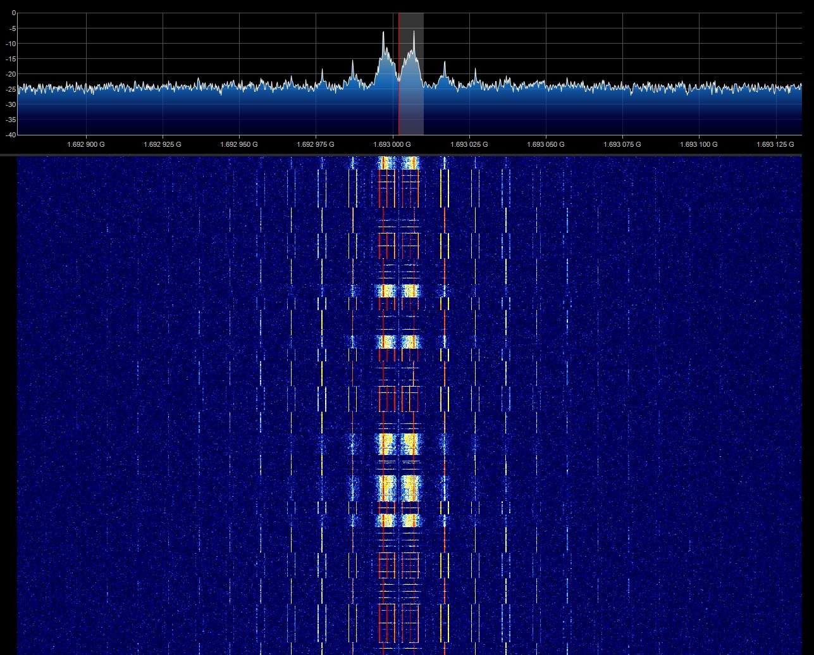
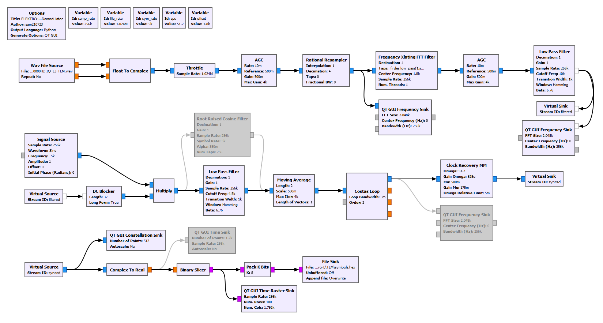
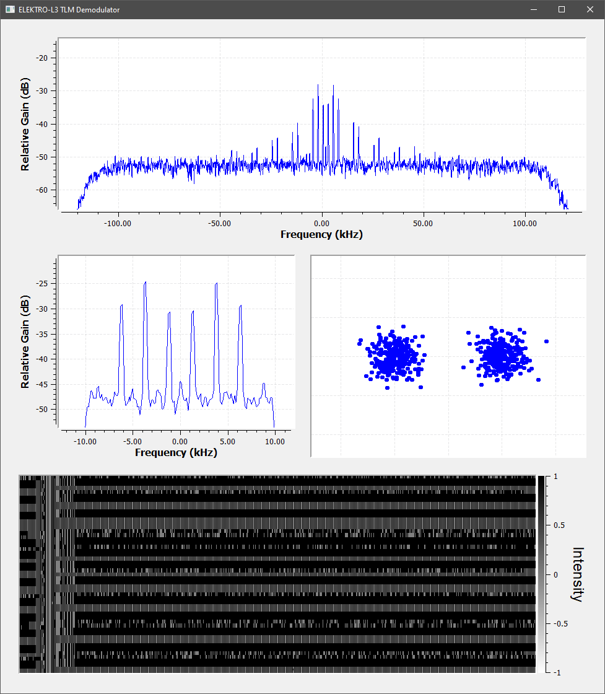
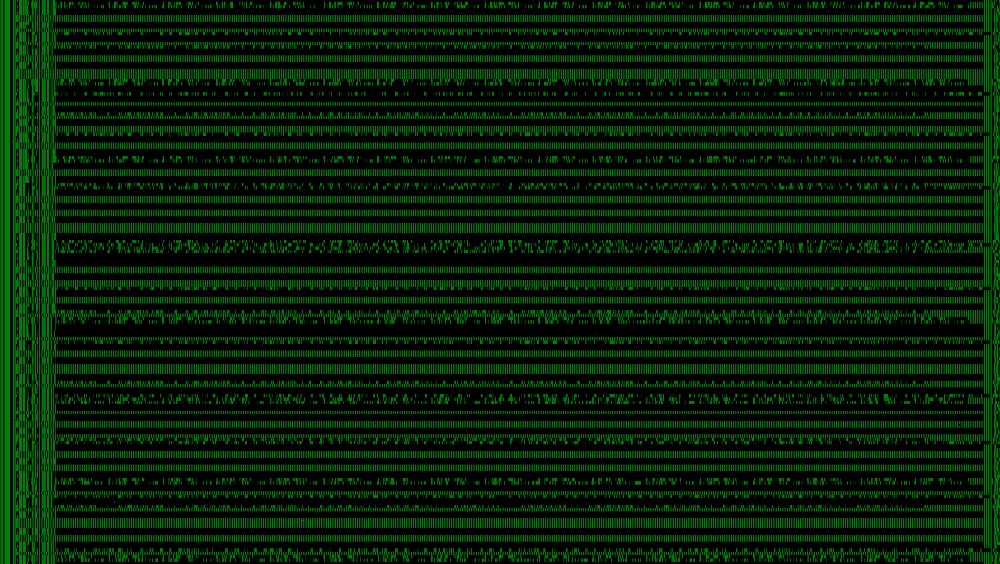

# ELEKTRO-L2/L3 Telemetry Receiver
Demodulator and decoder (WIP) for ELEKTRO-L2/L3 L-band telemetry downlink (TLM) on 1693 MHz.

The downlink is phase modulated at 5000 bps and contains 224 byte frames use the standard CCSDS sync word `0x1ACFFC1D`.

## Flowgraph

## Demodulator

## Frames

